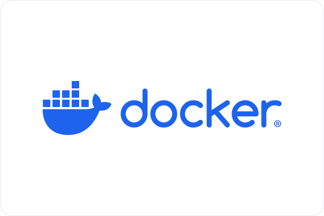
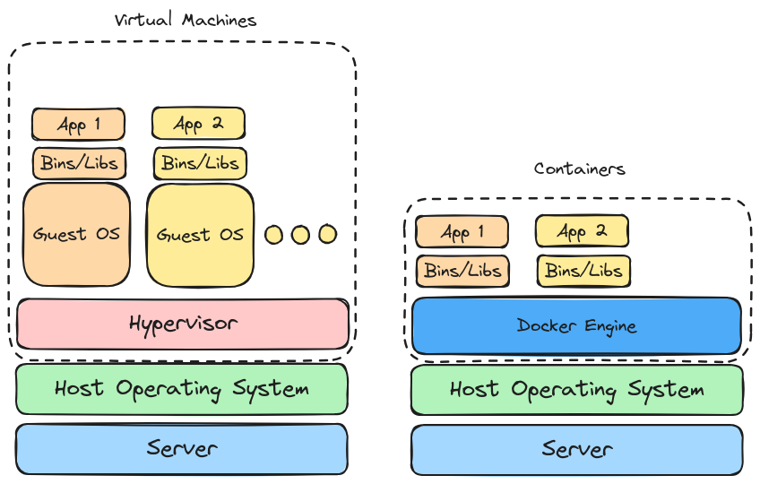

---
presentation:
    theme: solarized.css
---

<!-- slide -->



<!-- slide -->

## Demo

`demo-one/docker-compose.yml`

<!-- slide -->

### Jacob McCormick

- University of Minnesota - Duluth (2022)
  - Computer Science
  - Actuarial Science

- Software Engineer at Emerson (2021-Present)

<!-- slide -->

## What are containers?

- Sandboxed process on a host machine
  - Isolated from all other processes

- Containers are NOT virtual machines

<!-- slide -->



<!-- slide -->

## Why do I care?

<!-- slide -->

- Consistency across environments
- Isolation
- Portability
- Resource efficiency
- Scalability and rapid deployment
- Version control and rollback
- Dependency management

<!-- slide -->

### Docker command line

<!-- slide -->

### Run a Container

```bash
docker run <image>
```

```bash
docker run -d -p 8080:80 nginx
```

Flags:

- `-d`: Run a container in detached mode
- `-p`: Map a container port to a host port

<!-- slide -->

### List Running Containers

```bash
docker ps -a
```

Flags:

- `-a`: list all containers (including stopped)

<!-- slide -->

### Start/Stop a Container

```bash
docker stop <container_id>
```

```bash
docker start <container_id>
```
`

<!-- slide -->

### Remove a Container

```bash
docker rm <container_id>
```

Flags:

- `-f`: force remove a running container

<!-- slide -->

### Image Management

```bash
docker images # List images
```

```bash
docker pull <image_name>:<image_tag> # Pull an image
```

```bash
docker rmi <image_id> # Remove an image
```

```bash
docker build -t <image_name> <path_to_dockerfile>
```
`

<!-- slide -->

## Demo 2

```docker
FROM python:3

WORKDIR /usr/src/app

COPY requirements.txt ./
RUN pip install --no-cache-dir -r requirements.txt

COPY . .

CMD [ "python", "./app.py" ]
```
`demo-two/Dockerfile`

<!-- slide -->

### Publishing Docker images

```bash
docker login
```

```bash
docker image push myusername/hello-world-flask:latest
```
`

<!-- slide -->

#### Multi-stage Dockerfile

```docker
FROM mcr.microsoft.com/dotnet/runtime:8.0 AS base
USER $APP_UID
WORKDIR /app

FROM mcr.microsoft.com/dotnet/sdk:8.0 AS build
ARG BUILD_CONFIGURATION=Release
WORKDIR /src
COPY ["DockerDemo/DockerDemo.csproj", "DockerDemo/"]
RUN dotnet restore "DockerDemo/DockerDemo.csproj"
COPY . .
WORKDIR "/src/DockerDemo"
RUN dotnet build "DockerDemo.csproj" -c $BUILD_CONFIGURATION -o /app/build

FROM build AS publish
ARG BUILD_CONFIGURATION=Release
RUN dotnet publish "DockerDemo.csproj" -c $BUILD_CONFIGURATION -o /app/publish /p:UseAppHost=false

FROM base AS final
WORKDIR /app
COPY --from=publish /app/publish .
ENTRYPOINT ["dotnet", "DockerDemo.dll"]
```
`

<!-- slide -->

## Docker Compose

Plugin for defining and running mutli-container applications.

- Easy to manage services, networks, and volumes in a single YAML file

<!-- slide -->

#### Docker Compose - Navidrome

```yaml
services:
  navidrome:
    image: deluan/navidrome:latest
    user: 1000:1000 # should be owner of volumes
    ports:
      - "4533:4533"
    restart: unless-stopped
    environment:
      # Optional: put your config options customization here. Examples:
      ND_SCANSCHEDULE: 1h
      ND_LOGLEVEL: info  
      ND_SESSIONTIMEOUT: 24h
      ND_BASEURL: ""
    volumes:
      - "./navidrome-data:/data"
      - "./music:/music:ro"
```
`

<!-- slide -->

#### Docker Compose CLI

```bash
docker compose up -d
```

```bash
docker compose down
```

```bash
docker compose pull
```

```bash
docker compose ps
```
`

<!-- slide -->

### Multi-service compose

```yaml
services:
  web:
    build: .
    ports:
      - "8000:5000"
  redis:
    image: "redis:alpine"
```
`

<!-- slide -->

### Infra in a pinch


